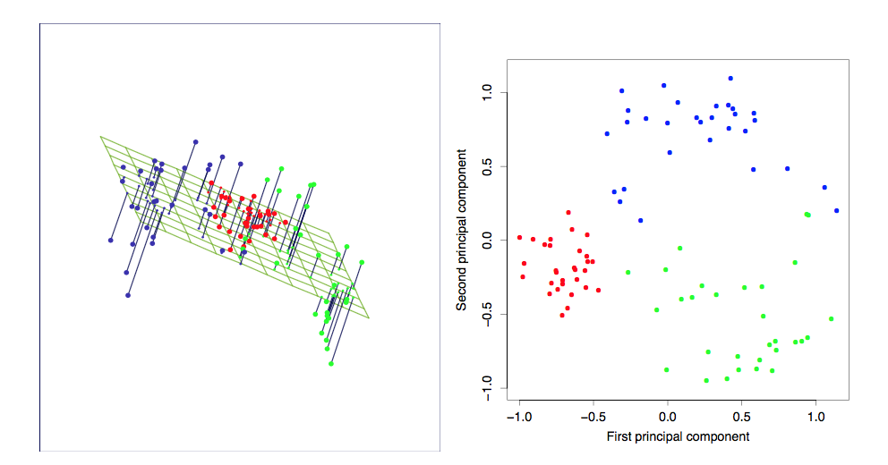

```{r setup, include=FALSE}
library(tidyverse)
wine <- read.table('./wine.txt', header = TRUE) %>% as_data_frame
```

## Part 1

### Estimating regression parameters from correlated features


## Regression

We all know about least squares regression, we have a quantitative output and one or more inputs. We would write the predicted value for case $i$ when there are $p$ features as:

$$
\hat{y_i} = \beta_0 + \Sigma_{j = 1}^{p} \beta_j x_{ij}
$$

```{r ols, fig.width=7.5, fig.height=3.5, echo = FALSE}
ggplot(mtcars, aes(wt, disp)) + 
  geom_point() +
  xlab('') +
  ylab('') +
  stat_smooth(method = 'lm', se = FALSE)
```

## Matrix notation
Since this is a linear combination of the inputs we can rewrite it conveniently for all cases to:

$$
\bf\hat{y} = \bf{X}\bf{\beta}
$$

Where $\bf\hat{y}$ is a vector with predictions, $\bf{X}$ is a matrix with each row the observations of one case and each column the values of a feature (with the first column being 1's), and $\bf{\beta}$ a vector with weights.

## Least squares

The loss we want to minimize, is called the residual sum of squares of the estimates. In matrix notation it is:

$$
RSS(\bf{\beta}) = (\bf{y} - \bf{X}\bf{\beta})^T (\bf{y} - \bf{X}\bf{\beta})
$$

We want to minimize this for $\bf{\beta}$, so we need to take the derivative w.r.t. $\bf{\beta}$ and set it to 0.

This yields:

$$
\bf{\hat{\beta} = (X^TX)^{-1} X^Ty}
$$

## Perfect multicollinearity

So we are looking for a $p$-dimensional hyperplane that minimizes the $RSS$ for the $p$ features w.r.t. $\bf{y}$.

What would happen if we mistakingly put two versions of the same feature in the model?

$$
\bf{\hat{\beta} = (X^TX)^{-1} X^Ty}
$$


## Perfect multicollinearity

```{r perfect_mc, echo = TRUE}
x <- mtcars %>% mutate(cyl2 = 2*cyl) %>% select(mpg, cyl, cyl2)
lm(mpg ~ ., data = x)
```

`lm` removes perfectly correlated features, but if it didn't we were unable to find a solution.

## High correlation

We rarely have perfect multicollinearity (singular $\bf{X}$ matrix), however often we do have many correlated features.

```{r wines, echo = TRUE, message=FALSE, fig.width=7.5, fig.height=3}
wine_cor <- wine %>% select(-class) %>% cor %>% round(2)
data.frame(cors = wine_cor[upper.tri(wine_cor)]) %>% 
  ggplot(aes(cors)) + 
  geom_histogram(fill = 'cornflowerblue', col = 'black')
```

## High correlation

Although the parameters can be estimated, the correlations impact the estimates.

```{r, echo = TRUE}
set.seed(1234)
x1 <- rnorm(100)
x2 <- x1 + rnorm(100, 0, .5)
cor(x1, x2)
y <- x1 + x2 + rnorm(100)
```
## High correlation
```{r}
lm(y ~ x1, data.frame(x1, y))$coefficients
lm(y ~ x2, data.frame(x2, y))$coefficients
lm(y ~ ., data.frame(x1, x2, y))$coefficients

```

## Just take another sample 

```{r, echo = TRUE}
set.seed(2345)
x1 <- rnorm(100)
x2 <- x1 + rnorm(100, 0, .5)
y <- x1 + x2 + rnorm(100)
lm(y ~ ., data.frame(x1, x2, y))$coefficients
```

We are going to explore this further in **Lab 1**.

## Results lab 1


## Part 2

### Feature interpretation

## Machine Learning

Effects can not bet disentangled. Does this matter?

- for prediction? No, as long as predictions are accurate.
- for interpretation? Yes, we can't report the individual effects.

Note that variance of the parameter estimates is different from variance in prediction function.

Former is thus caused by correlated features, latter by too few data points for the complexity we want to model.

## What if interpretation matters?

Just gathering lots of data points on many features in an algorithm might get the job done.

But often we are looking for understanding as well as accurate predictions:

- Leads to better models (what can we do to improve?)
- Better explanation to business
- Justification to outside world (regulators)
- Reduces algorithm-anxiety of the customer

## How to get understanding?

We can get the variable importance explicitly from regularized regression, or implicitly with feature importance.

This is often what we report, but it only shows feature importance in the model.

Besides, we can look at univariate relationships between fearures and targets:

- linear: correlation, R sq. of univariate regression.
- nonlinear: correlation, R sq. of transformations, gini, prediction stats with ml methods.

## Wine example: boosting
```{r, cache = TRUE,  fig.width=7.5, fig.height=3.5, warning = FALSE}
wine <- read.csv('./wine.csv')
wine$class <- as.numeric(wine$class == 1)
boosted_tree <- gbm::gbm(class ~ ., data = wine, n.trees = 1000, 
        interaction.depth = 2, cv.folds = 5, distribution = 'bernoulli')
data.frame(y_scale = boosted_tree$cv.fitted, class = factor(wine$class)) %>% 
  ggplot(aes(y_scale)) + geom_density(aes(fill = class), alpha = .5)  
```

## Relative information from `gbm`

```{r, eval= FALSE, include = FALSE}
rel_inf <- summary(boosted_tree) %>% 
  mutate(rel_inf = rel.inf / 100) %>% select(-rel.inf)
save(rel_inf, file = './relative_information.Rdata')
```

```{r}
load('./relative_information.Rdata')
ggplot(rel_inf, aes(var, rel_inf)) + 
  geom_bar(stat = 'identity') + coord_flip()
```


## Univariate predictive value

```{r}
graphic_univariate <- 
  gather(wine, feature, value, -class) %>% 
  mutate(class = factor(class)) %>% 
  group_by(feature) %>% 
  mutate(z_value = scale(value)) %>% 
  ggplot(aes(z_value)) + 
  geom_density(aes(fill = class), alpha = 0.5) +
  facet_wrap(~feature, scale = 'free_y')
```

## Univariate predictive value

```{r}
graphic_univariate
```


## Correlation among features

```{r}
library(corrplot); wine %>% select(-class) %>% cor %>% corrplot(method = 'square')
```

## Part 3

Dimension reduction with PCA

## PCA

A principal components fits *q* vectors in the *p*-dimensional feature space. Where *q* is the rank of *p*.

Mathematically quite involved, lets look at the intuition.

Component 1: the vector in *p*-dimensional space that explains most of the variance in the features.

Further components: the vector that explains most of the remaining variance and is orthogonal to previous components.

So amount of variance explained is by definition diminishing over the components.


## PCA visual

Fitting two components to three features:



## Number of components

The higher the correlations among the features, the less components we need to explain nearly all the variance.

Rule of thumb for number of components, look for the elbow in the "scree plot".

```{r,fig.width=7.5, fig.height=3.5, echo = FALSE}
pca_mtcars <- mtcars %>% apply(2, scale) %>%  prcomp
broom::tidy(pca_mtcars, "pcs") %>% 
  ggplot(aes(PC, percent)) +
  geom_bar(stat = 'identity', fill = 'cornflowerblue', col = 'black') +
  ylab('Variance explained') + 
  scale_x_continuous(breaks = 1:11,
        labels = 1:11)
```

## Keep in mind

* Tries to explain as much absolute variacne, so all features should be at the same scale.

* Like correlation, it compresses **linear** relationships, nonlinear alternatives are available.

## Interpreting the PCs

Look at the loadings of the features on the components.

```{r, fig.height = 3}
pca_mtcars <- mtcars %>% apply(2, scale) %>% prcomp
pca_mtcars$rotation[, 1:4]
```


## Biplot

Both the features and the cases have a score on the PCs, the features have the loading, the cases the projections. Visualising them together can be very insighful.

```{r, echo = FALSE}
pca_mtcars %>% biplot
```

## That's all

Go on to the final lab.
